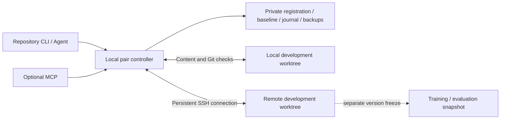

<div align="center">


# Worktree Bridge

**Register once inside your repository to coordinate local and SSH development worktrees.**

Bidirectional file sync · Protected Git fast-forward · CLI status · Optional MCP

[中文](README.md) · [Quick start](#quick-start) · [Configuration](docs/configuration.md) · [MCP](docs/mcp.md) · [Validation](docs/validation.md)


</div>

Worktree Bridge is for developers whose coding agent and editor run locally while training, evaluation, or some code changes happen on an SSH host. Run `wtb init` inside an existing Git repository to register one explicit pair of development directories. Once started, the background service synchronizes supported source files and documents; CLI and MCP report differences, conflicts, Git blockers, and connection state.

**Experimental release 0.3.0.** The core uses the Python standard library, Git, and OpenSSH. MCP is optional. See the [validation record](docs/validation.md) for tests, SSH acceptance, and measurements. Registration does not adopt other copies; code used by an active training run should be frozen separately.

## What it does

| Capability | Behavior |
|---|---|
| Repository registration | `init` records the current Git worktree and an explicit peer. Subsequent commands discover the pair without repeating a configuration path. |
| Bidirectional incremental sync | A common baseline identifies changes on either side. Incremental observation and periodic full reconciliation check actual files. |
| Explicit differences | `status` reads cached state; `watch` reports changes continuously. Offline peers, stale observations, file conflicts, and Git divergence cannot appear synchronized. |
| Follow existing commits | Fast-forward a peer only when branch, ancestry, and worktree protection checks pass. Commits may originate on either side. |
| Explicit checkpoints | Create a local commit for eligible work and an optional tag. Saving a file does not create a commit. |
| Agent integration | JSON output by default, an installable Skill, and optional MCP, sharing one controller per pair. |

File contents, Git history, and an agent's loaded context are checked separately. Transferred bytes do not prove that Git has followed; an updated `AGENTS.md` on disk does not prove that a running agent reread it.

## Quick start

### 1. Install

The controller requires **Python 3.10+, Git, and an OpenSSH client**. SSH targets require **Python 3.9+ and Git**. Configure key-based login and trust the target host key first.

```console
git clone https://github.com/fingercd/worktree-bridge.git
cd worktree-bridge
python -m pip install .
wtb --help
```

Or install a fixed release from GitHub:

```console
python -m pip install "worktree-bridge @ git+https://github.com/fingercd/worktree-bridge.git@v0.3.0"
```

`wtb` and `worktree-bridge` are aliases for the same CLI. Installation is currently from source or GitHub.

### 2. Register inside an existing repository

```console
cd D:/work/my-project
wtb init --remote gpu-dev --path /home/researcher/projects/my-project
```

`gpu-dev` may be an existing SSH config alias. Omitting `--port` preserves its configured port. Add `--name my-project` to set the pair's display name.

**`init` only registers the pair.** It does not run `git init`, commit, overwrite project files, or synchronize immediately. Pairing information is stored in private local metadata. The current directory must belong to an existing Git repository. Subsequent commands discover the pair from that repository or a subdirectory.

The initial common baseline requires matching HEAD, named branch, and supported file bytes. Preserve and reconcile existing differences using the [onboarding guide](docs/onboarding.md) before enabling automatic sync. An existing JSON configuration can be registered with:

```console
wtb init --from-config D:/work/bridge-config/project.json
```

### 3. Start and inspect

```console
wtb start
wtb status --short
wtb watch --interval 0.5
```

`start` launches the local controller in the background without an extra console window on Windows. The remote peer runs over the existing SSH connection, with no public-facing service installation. `status` returns JSON by default; `--short` provides concise text. `watch` continuously reports state changes; Ctrl+C ends observation.

This is a command-flow illustration, not a recorded terminal session:

```text
Existing Git repository
  └─ wtb init     Register one directory pair
       └─ wtb start    Enable background observation and sync
            ├─ wtb status    Inspect state and differences
            ├─ wtb watch     Observe changes continuously
            └─ wtb wait      Verify actual state after a save
```

Default `status` fails with a start instruction when the service is stopped. It does not silently switch to a slow remote full scan. Use `wtb status --fresh` for an explicit independent full check.

## Daily commands

Run these inside the registered repository. `--config PATH` remains available as an advanced override.

| Command | Purpose |
|---|---|
| `projects` | List locally registered projects. |
| `start` / `stop` | Start / stop the current pair's background service. |
| `serve` | Run in the foreground for logs or your own process manager. |
| `status` / `status --short` | Read cached JSON / concise text status. |
| `watch --interval 0.5` | Observe text status changes continuously. |
| `sync` / `sync --wait` | Request immediate reconciliation and sync; optionally wait for its result. |
| `pause` / `resume` | Pause / resume automatic sync. An in-flight action may complete. |
| `conflicts` | Read conflicts and the current `revision`. |
| `wait --timeout 30` | Request a read-only observation and wait for confirmed agreement. No transfer or pause override. |
| `checkpoint -m "experiment setup" --tag exp-001` | After both sides match, create a local commit for eligible work and an optional tag, then let the peer follow. |
| `mcp` | Run the optional MCP stdio adapter. Install the extra and start the service first. |

A write response containing `queued: true` only acknowledges acceptance. Check the result with subsequent status or a wait. `wait` requires its own new observation to complete; an old green cache cannot satisfy it. With automatic sync disabled or paused, pending differences must first be handled through an allowed action.

To resolve a conflict, review both versions and pass the freshly returned `revision` with your choice:

```console
wtb conflicts
wtb resolve src/model.py --take local --revision TOKEN
wtb wait --timeout 30
```

`--take local` replaces remote contents with the local version; `--take remote` does the reverse. A stale revision is rejected. The tool does not select a winner by modification time or automatically merge files.

Automatic Git following handles existing commits. It does not copy `.git`, automatically merge, rebase, stash, force-push, or push your project to GitHub. New history is audited before transfer, including files removed before its final tree. Automatic review is limited to **128 commits, 4096 per-commit path entries, and an 8 MiB Git bundle**, with path exclusions, size, and mode checks. Exceeding these bounds blocks transfer; use a reviewed native Git workflow.

`checkpoint` creates a commit through guarded native Git plumbing and **does not run `git commit` hooks**. Run required pre-commit or other checks first, or commit through the project's normal workflow and let the service follow. Tag important experiments and separately record configuration, seed, data, and weight versions.

## How it works and its limits



Each registration has one pair and one controller. File events are hints; content and Git are checked before writes. Connection failure produces an offline state; reconnection reads actual state again. Writes with unknown outcomes are not blindly replayed. `synced` requires a current valid observation, and a stale observation becomes `checking`. Inspect connection, observation time, and errors together.

- **Selection is limited.** Git-tracked files and nonignored untracked regular small files are eligible, with a 1 MiB per-file limit. Built-in rules exclude Git metadata, common secrets, data and output directories, model weights, links, and nested repositories. Supported tracked source under `data/` and `datasets/` remains eligible. Name filters do not replace `.gitignore` or secret review.
- **Bytes are preserved.** There is no implicit CRLF/LF conversion, Unix executable-bit, owner, ACL, or Git index synchronization. Review `.gitattributes` before onboarding a Windows/Linux pair.
- **Deletion is off by default.** `allow_delete` defaults to `false`; enabling it still requires baseline, conflict, and write preflight checks.
- **There is no cross-host transaction.** File replacement is atomic per file, but a batch may partially complete. Recover using journals, backups, and actual state. The service cannot lock arbitrary editors or training processes and does not promise zero loss under arbitrary concurrent editing.
- **Directory roles are explicit.** Branch copies, old roots, and training snapshots sharing an origin are not automatically paired. Active training uses a frozen snapshot; sync applies only to registered development roots.

## Agents, configuration, and development

Install [`skills/worktree-bridge`](skills/worktree-bridge/SKILL.md) into your agent's skills directory and make the CLI available. The Skill handles document rereading, blockers, and handoff; installation does not grant commit, push, training, or publishing permission. MCP shares the CLI controller; see the [MCP guide](docs/mcp.md).

Existing JSON configuration and `baseline`, `plan`, and `apply` remain compatible. Keep plan files outside the worktrees. An active service blocks legacy `apply` writes. `baseline --refresh` cannot bypass differences. See [configuration](docs/configuration.md), [onboarding](docs/onboarding.md), [design](docs/design.md), [validation](docs/validation.md), [SSH acceptance](docs/ssh-acceptance.md), and [related-tool research](docs/research.md). Detailed reference pages are currently in Chinese.

```console
python -m pip install -e .
python -m unittest discover -s tests -v
```

Default tests use isolated temporary worktrees; SSH acceptance uses dedicated copies. Remove real hosts, private paths, and secret contents from issue reports. Licensed under [MIT](LICENSE).
