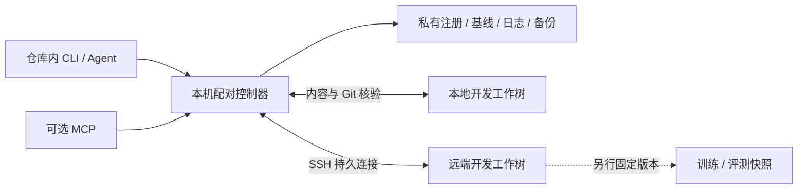

<div align="center">


# Worktree Bridge

**在仓库里注册一次，让本地与 SSH 远端的开发工作树持续协同。**

双向文件同步 · 受保护的 Git 快进 · CLI 状态 · 可选 MCP

[English](README.en.md) · [快速开始](#快速开始) · [配置](docs/configuration.md) · [MCP](docs/mcp.md) · [验证记录](docs/validation.md)


</div>

Worktree Bridge 面向这样的开发方式：编码 Agent 和编辑器在本机，训练、评测或部分代码修改在 SSH 服务器。进入已有 Git 仓库，用 `wtb init` 明确注册一对开发目录；启动后，后台服务同步受支持的源码与文档，CLI 和 MCP 返回两端不一致、冲突、Git 阻止项与连接状态。

**0.3.0 实验版本。** 核心只依赖 Python 标准库、Git 和 OpenSSH，MCP 是可选组件。测试范围、真实 SSH 验收与性能测量见[验证记录](docs/validation.md)。注册不会接管其他副本；正在训练的代码目录应另行冻结。

## 能做什么

| 能力 | 实际行为 |
|---|---|
| 仓库内注册 | `init` 记录当前 Git 工作树与指定远端的配对；之后在仓库内直接运行命令，不必每次写配置路径。 |
| 双向增量同步 | 根据共同基线判断单侧修改，支持本地和远端改动；增量观察与定期全量核对共同检查文件。 |
| 明确报告不一致 | `status` 查看缓存状态，`watch` 持续显示变化；离线、过期观察、文件冲突和 Git 分叉不会显示成同步完成。 |
| 跟进已有 commit | 同分支、真实后继关系且工作区保护条件满足时，让另一端快进；支持任一端先提交。 |
| 显式固定版本 | `checkpoint` 从本地创建所选工作的 commit，可附带 tag；保存文件不会自动创建 commit。 |
| Agent 接入 | 默认 JSON 输出、可安装 Skill、可选 MCP；全部共享同一个配对控制器。 |

文件内容、Git 历史和 Agent 已读上下文分别核对。文件到达远端不等于 Git 已跟进，`AGENTS.md` 写入磁盘也不等于运行中的 Agent 已重读它。

## 快速开始

### 1. 安装

控制端需要 **Python 3.10+、Git、OpenSSH 客户端**；SSH 目标需要 **Python 3.9+ 与 Git**。先确认密钥登录可用，并已信任目标主机密钥。

```console
git clone https://github.com/fingercd/worktree-bridge.git
cd worktree-bridge
python -m pip install .
wtb --help
```

也可以从 GitHub 安装固定版本：

```console
python -m pip install "worktree-bridge @ git+https://github.com/fingercd/worktree-bridge.git@v0.3.0"
```

`wtb` 与 `worktree-bridge` 是同一 CLI 的两个名字。本项目目前通过源码或 GitHub 安装。

### 2. 在已有仓库里注册

```console
cd D:/work/my-project
wtb init --remote gpu-dev --path /home/researcher/projects/my-project
```

`gpu-dev` 可以是已有 SSH config 别名；省略 `--port` 时保留该别名的端口。可加 `--name my-project` 设置配对名称。

**`init` 只注册配对。** 它不运行 `git init`，不提交、不覆盖项目文件，也不立即同步。配置保存在本机私有元数据中；当前目录必须属于已有 Git 仓库。之后从该仓库或其子目录运行命令，即可发现这份配对。

第一次共同基线要求两端 HEAD、具名分支和所选文件内容一致。已有项目不一致时，先按[首次接入说明](docs/onboarding.md)分别保全并整理差异，再启用自动同步。已有 JSON 配置可迁移注册：

```console
wtb init --from-config D:/work/bridge-config/project.json
```

### 3. 启动并查看

```console
wtb start
wtb status --short
wtb watch --interval 0.5
```

`start` 在本机后台启动控制器，Windows 上不会弹出额外控制台窗口；远端配对进程沿现有 SSH 连接运行，无需安装对外开放的服务。`status` 默认返回 JSON；`--short` 给出简短文本。`watch` 持续显示状态变化，用 Ctrl+C 退出观察。

下面是命令流程示意，具体结果由仓库当前状态决定：

```text
已有 Git 仓库
  └─ wtb init     注册一对目录
       └─ wtb start    启用后台观察与同步
            ├─ wtb status    查看状态与不一致
            ├─ wtb watch     持续观察变化
            └─ wtb wait      核对保存之后的实际状态
```

服务未启动时，默认 `status` 明确提示 `start` 并退出失败，不自动做慢速远端全量扫描。需要独立全量检查时，显式运行 `wtb status --fresh`。

## 日常操作

在已注册仓库内运行以下命令；`--config PATH` 仍作为高级覆盖方式保留。

| 命令 | 用途 |
|---|---|
| `projects` | 列出本机已注册项目。 |
| `start` / `stop` | 启动 / 停止当前配对的后台服务。 |
| `serve` | 前台运行，便于查看日志或使用自己的进程管理工具。 |
| `status` / `status --short` | 读取缓存 JSON / 简短文本状态。 |
| `watch --interval 0.5` | 持续观察文本状态变化。 |
| `sync` / `sync --wait` | 请求立即核对与同步；可等待本轮结果。 |
| `pause` / `resume` | 暂停 / 恢复自动同步；已开始的动作可能完成。 |
| `conflicts` | 查看冲突列表与当前 `revision`。 |
| `wait --timeout 30` | 发起一次只读核对，并等待确认一致；不触发传输、不绕过暂停。 |
| `checkpoint -m "experiment setup" --tag exp-001` | 两端先一致后，从本地创建所选工作的 commit 与可选 tag，再让远端跟进。 |
| `mcp` | 运行可选 MCP stdio 适配器，需先安装 extra 并启动服务。 |

写动作返回 `queued: true` 只表示请求已接受。用后续 `status` 或 `wait` 核对结果。`wait` 要求它发起的新一轮观察已完成，旧的绿色缓存不能满足等待；若关闭自动同步或暂停，待处理差异需要先通过允许的操作处理。

处理冲突时先审阅两端内容，再用刚返回的 `revision` 选择保留哪一端：

```console
wtb conflicts
wtb resolve src/model.py --take local --revision TOKEN
wtb wait --timeout 30
```

`--take local` 用本地内容替换远端，`--take remote` 相反。状态变化后旧版本会被拒绝。工具不按修改时间决定胜出者，不自动合并文件。

Git 自动跟进只处理已有提交，不复制 `.git`，不自动 merge、rebase、stash、强推或向项目 GitHub 推送。传输前会审核新增历史，包括最终版本已删除的文件；自动处理限制为 **128 个提交、4096 个逐提交路径条目、8 MiB Git bundle**，并检查排除路径、大小及文件模式。超过范围会阻止，需通过 Git 原生流程审阅处理。

`checkpoint` 使用受检查的 Git 原生底层操作创建提交，**不会运行 `git commit` hooks**。依赖 pre-commit 等检查的项目应先运行相应检查，或按项目流程手动提交，再让服务跟进。重要实验固定 tag，并另行记录配置、seed、数据与权重版本。

## 工作方式与限制



每份注册是一对目录、一个控制器。文件事件是提示，写入前仍核验内容和 Git 状态。连接失败时报告离线，重连后重新读取实际状态；结果未知的写入不会盲目重放。`synced` 只表示最新有效观察满足一致条件；观察过期会进入 `checking`。请结合连接、观察时间与错误查看状态。

- **同步范围有限。** 只传 Git 跟踪文件与非忽略的未跟踪普通小文件，单文件上限 1 MiB。内置规则排除 Git 元数据、常见秘密文件、数据和产物目录、模型权重、链接与嵌套仓库；`data/`、`datasets/` 中已跟踪的受支持源码可同步。名称过滤不能代替 `.gitignore` 或秘密审查。
- **保留文件字节。** 不自动转换 CRLF/LF，不同步 Unix 执行位、所有者、ACL 或 Git 暂存区。Windows/Linux 首次接入前应审阅 `.gitattributes`。
- **删除默认关闭。** `allow_delete` 默认 `false`；启用后仍受基线、冲突和写入前核验约束。
- **不是跨主机事务。** 单文件原子替换，整批操作可能部分完成；根据日志、备份与实际状态恢复。服务无法锁住任意编辑器或训练进程，不承诺任意并发编辑下零丢失。
- **目录角色要明确。** 同 origin 的分支副本、旧项目与训练快照不会自动配对。运行中的训练使用冻结快照，开发同步只针对显式注册的目录。

## Agent、配置与开发

将 [`skills/worktree-bridge`](skills/worktree-bridge/SKILL.md) 安装到 Agent 的 skills 目录，并确保 CLI 可用。Skill 负责项目文档重读、阻止项解释与交接；安装本身不授予 commit、push、训练或发布权限。MCP、CLI 共享控制器，详见[MCP 接入](docs/mcp.md)。

原有 JSON 配置与 `baseline`、`plan`、`apply` 保留兼容。计划文件须放在工作树外；服务运行时拒绝旧 `apply` 直接写入。`baseline --refresh` 不能跳过差异。参见[配置](docs/configuration.md)、[首次接入](docs/onboarding.md)、[设计](docs/design.md)、[验证](docs/validation.md)、[SSH 验收](docs/ssh-acceptance.md)和[相关工具调研](docs/research.md)。

```console
python -m pip install -e .
python -m unittest discover -s tests -v
```

默认测试使用隔离临时工作树；真实 SSH 验收使用专用副本。提交问题报告前，去掉日志中的真实主机、私有路径与秘密内容。采用 [MIT 许可证](LICENSE)。
