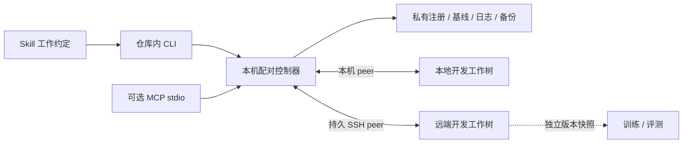

# 协同模型与实现边界

0.3 以当前 Git 工作树为入口：注册一次具体配对，由一个本机后台控制器观察两端，CLI 和可选 MCP 查询与操作同一状态。工具不按项目名或 Git origin 猜测配对，也不自动接管已有分叉。

## 三个不同状态

| 状态 | 例子 | 实现责任 |
|---|---|---|
| 工作文件 | Python 源码、AGENTS.md、CONTEXT.md | 共同基线、三方比较、受检查的内容传输。 |
| Git 历史与暂存区 | HEAD、branch、commit、index、merge 状态 | 原生 Git 对象传输与受保护快进；暂存工作不通过文件复制镜像。 |
| Agent 已读上下文 | 本轮实际读取的项目规则与状态 | Agent / Skill 成功后显式重读；文件到达不证明宿主已重载。 |

这三类状态分别报告。`synced` 是服务最近一次有效观察满足文件与 Git 一致条件；它不能证明 Agent 已重读规则，也不是跨主机瞬时原子保证。

## 注册、控制器与接口

`init` 只在 Git 私有目录和用户状态目录注册配对，不修改项目跟踪文件、不创建仓库、不提交、不立即同步。linked worktree 使用各自私有 Git 目录；从当前仓库子目录可发现配置。`projects` 读取本机注册索引，`--config` 可显式覆盖，旧 JSON 配置可迁移。

`start` 启动隐藏后台服务，`serve` 前台运行。一个配对只有一个控制器，文件与 Git 写动作串行执行；OS 锁与远端控制器声明阻止服务、旧 `apply` 或其他控制器同时写同一配对。锁不约束任意外部编辑器、Git 命令或训练进程。

CLI 和 MCP 通过仅本机可访问的控制接口操作服务。请求检查服务实例与配置身份，固定项目，不提供任意 shell、目录或 URL 操作。MCP 使用可选官方 Python SDK；核心与远端无需安装它。

## 观察、缓存与失败

文件监测是变化提示；持久 peer 缓存选择与内容指纹，定期强制核对，传输前核验当前字节和 Git 状态。Git 元数据、ignore 规则和文件变化均可能使缓存失效。SSH 保留已配置别名端口与主机信任，不在远端安装公开服务。

`status` 读取后台缓存，不等待新全量扫描；服务未启动时失败而不是自动切换慢扫。`status --fresh` 才使用旧独立全量扫描路径。`watch` 持续显示文本变化与事件，不启动另一套同步器。

状态包含连接、实际 `observed_at`、发布时间、最近成功同步、错误与 revision。过期的 `synced` 变为 `checking`，网络失败显示 `offline`，不能用旧缓存显示假成功。`wait` 提交只读观察屏障，要求本次观察已完成且状态为 `synced`；它不传输文件、不跟进 Git，不绕过暂停或关闭自动同步。`queued: true` 只是排队回执。

请求 id 和持久写入记录区分已接受、执行中、完成与失败。超时后可能已经部分写入，先读取实际状态与记录；不能盲目重放整个批次。单文件原子替换不是多文件或跨主机事务。

## 共同基线与冲突

设 B 是上次共同内容，L/R 是本地/远端当前内容：

| 条件 | 处理 |
|---|---|
| L = R | 无需复制，核验后更新共同状态。 |
| L = B，R != B | 从远端复制到本地。 |
| R = B，L != B | 从本地复制到远端。 |
| L != B，R != B，L != R | 冲突，整批文件传输不开始。 |
| 无基线且 L != R | 无法推断修改方向，先整理首次接入。 |
| 基线文件消失 | 默认报告删除阻止；仅配置允许删除且核验通过时传播。 |

首次基线绑定具体端点、Git HEAD/分支和所选文件字节，双方已一致才建立。按字节比较意味着 CRLF/LF 也属于差异；不按 mtime 选赢家，不在后台重写换行。

冲突选择是显式写操作：相对路径、`local` / `remote` 选择和当前 `revision` 缺一不可。执行时重新核验版本与内容；状态变了就返回过期，不能把旧选择当成对后续改动的授权。`baseline --refresh` 同样不能忽略现有差异。

同步范围限于受支持的 Git 跟踪和非忽略未跟踪普通小文件，1 MiB 单文件上限及内置排除继续生效。符号链接、嵌套仓库、Git 元数据和常见数据/权重不作为普通文件复制；名字过滤不能完整检测秘密。

## Git 跟进与 checkpoint

自动 Git 处理已有提交，普通保存不会创建 commit。满足同一具名分支、单侧从记录基线前进、真正后继关系、目标无独立暂存或分叉工作、无活跃 Git 操作时，可把另一端安全快进。已经通过文件同步到达目标的字节须保留，不能因为目标显示 dirty 就重置。双端历史分叉、切分支、未完成 merge/rebase 和不能证明可保全的改动返回 `git_blocked`。

Git 元数据由 Git 原生命令管理，不复制 `.git` 或 index，不自动 merge/rebase/stash/reset、强推或发布项目代码。传输审核新增历史各提交路径与 blob，包括后来已删除的文件；自动审核上限为 128 个提交、4096 个逐提交路径条目、8 MiB bundle，并检查排除路径、大小和模式。超限或不支持路径停止，改用经审阅的原生 Git 流程。

`checkpoint` 是显式请求，两端一致且无独立暂存工作后，在本地创建 eligible 文件的 commit，可创建 tag，再让远端跟进。使用临时 index、原生对象和受条件检查的 ref 更新，保留前后记录；它不调用 `git commit`，所以不运行 commit hooks。需要 hooks 检查时先自行运行项目检查，或使用项目的手动提交流程。

Git 跟进成功后重新核对文件并更新绑定新 HEAD 的共同基线。旧 HEAD 的内容基线不能解释新提交之后的编辑：例如旧基线 A、两端提交到 B、本地改回 A，若沿用旧基线会错误覆盖本地。因此 Git 与文件基线更新是同一控制流程的一部分。

## 项目规则与训练目录

公共 `AGENTS.md` 保存共同开发约定；主机地址、凭据、解释器与机器选择放在私有配置。保留已有项目规则，不因工具接入批量重写。文档冲突需审阅，历史记录里的授权不能扩展当前任务权限。

同步完成后，Agent 显式读取变化的 `AGENTS.md`、`CONTEXT.md` 等文档。依赖同步结果的工作等待新观察确认；部分失败时不以部分到达的规则继续任务。交接记录文件/Git状态与实际重读过的文档。

开发目录持续同步，训练与评测使用独立冻结快照。实验记录 commit/tag、必要未提交清单、配置、seed、环境、数据和权重版本。工具不探测训练进程，也不能保证运行代码不会读取混合版本，所以活跃运行根不作为同步目标。

## 验证边界

0.3 已完成本机隔离集成、正式 MCP SDK 测试与真实 Windows→Linux 持久 SSH 端到端验收。真实路径覆盖新观察、缓存状态、双向编辑、冲突与过期选择、文件生命周期、远端原生 commit 跟进、checkpoint/tag；具体证据与性能见[验证记录](validation.md)。0.2 的[真实隔离 SSH 历史验收](ssh-acceptance.md)仍保留，记录当时的显式计划路径，与 0.3 后台路径分别标注。

首次接入仍按[onboarding](onboarding.md)先盘点与保全，再建立一致开发副本，最后注册和启动。运行快照、旧副本、多人实时编辑、任意分叉自动合并和全量 Agent 会话迁移均不由当前流程自动接管。
