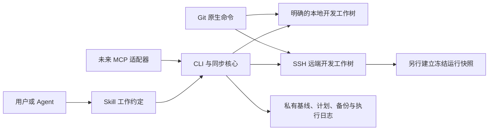

# 协同模型与实施路线

## 三个不同状态

| 状态 | 例子 | 由谁管理 |
|---|---|---|
| 工作文件 | Python 源码、AGENTS.md、CONTEXT.md、项目文档 | 同步核心比较内容、计划传输和核验 |
| Git 历史与暂存区 | commit、branch、HEAD、index、merge 状态 | Git 原生命令；同步工具只检查并阻止不合适的文件操作 |
| Agent 已读取的上下文 | 本轮实际读过的规则和项目状态 | Skill/Agent 会话显式重新读取；MCP 可提供新鲜度信息 |

文件同步不保证另外两个状态也同步。设计目标应是让这些状态可区分、可检查、有明确失败结果，而不是承诺永远不会出错。

## Skill、CLI 和 MCP 的分工

Skill 规定进入项目、读文档、规划同步和交接的方式。它不能观察不经过 Agent 的每次文件保存。CLI 用代码执行确定性检查，是实际的工具。MCP 将这套能力提供给不方便运行 CLI 的 Agent，它本身不会成为另一种同步算法。

## 目录配对是显式配置

使用同一个 origin 的目录可以是主分支、实验分支、他人 fork、固定运行快照或审计副本。不能自动把它们都双向绑定。每份配置指定一个本地根和一个远端根，私有状态属于这一对端点。变更目录身份时不能复用旧基线。

多节点共享存储也不等于多个副本。SSH 连接到不同计算节点但指向同一共享路径时，只能视为同一个存储端点，不能启动两套相互竞争的同步器。

## 基线与冲突

设 B 是上次双方一致的文件内容，L/R 是本地/远端当前内容。

| 条件 | 结果 |
|---|---|
| L = R | 无需复制；成功后可更新共同基线 |
| L = B，R != B | 从远端复制到本地 |
| R = B，L != B | 从本地复制到远端 |
| L != B，R != B，L != R | 冲突，整批不写 |
| 缺少基线且 L != R | 无法判断谁改了；先做已有项目接入整理 |
| 基线中的文件消失 | 原型拒绝，不自动删除另一端 |

不采用修改时间较新者覆盖：机器时钟、复制行为和 Git checkout 都会影响 mtime。也不把“服务器上经常训练”当成所有文件服务器权威。

当前原型的文件同一性按字节判定。换行可单独报告为“文本语义看起来一致”，但不能将此推断当作真正逐字节相同的写入前条件。

## AGENTS.md 与机器配置

建议维护一份受版本管理的项目公共约定，内容包括模块结构、工作流程、测试方法、产物记录位置。机器地址、解释器绝对路径、凭据和本次设备选择放在私有配置或明确的机器说明里。若宿主不自动读取机器说明，公共约定提供阅读导航，不能假设所有 Agent 识别自创文件名。

当前项目已有规则时，不批量重写成新模板。先识别公共规则、历史记录、机器特有事实与当前用户授权；只在用户希望整理时做最小修改。文档冲突也必须审阅，不能用语言模型自动判断哪份授权“更强”。

同一次代码改动相关的文档应进入同一同步计划。Agent 在成功后重新读变化文档；计划失败时不以部分到达的文档继续执行依赖任务。

## 运行训练时怎么办

开发目录用于修改与同步，训练目录用于固定版本运行。每次实验记录 Git SHA、必要的未提交补丁或内容清单、配置与环境摘要、输出位置。训练启动后不再原地同步它使用的代码。

文件逐个写入会暂时产生混合版本，Python 也可能在运行时重新导入模块或读取配置。即使单文件替换是原子的，也不应当把活跃训练根目录作为同步目标。这是工作流约束，当前 CLI 不会探测或锁定训练进程。

## Git 操作怎样协同

Git hooks 在特定 Git 事件触发；普通编辑器保存文件不会触发 commit hook。因此“加一个 post-commit hook”不能覆盖用户描述的任何改代码场景。[Git hooks 官方文档](https://git-scm.com/docs/githooks)。

后续类似 Git 的体验可以是 `bridge status`、`bridge plan`、`bridge sync`、`bridge git ...`，但后一项还未实现。其最基本顺序是暂停文件传输、确认两端无并发编辑、保全各自未提交工作、执行获授权的 Git 操作、通过 Git 协调另一端历史、重新核验、恢复同步。遇到未提交改动不能偷偷 stash/reset；两个独立 checkout 的暂存区也不能靠复制 `.git/index` 保持一致。

当前原型发现两端 HEAD/branch 不同，或当前 Git 版本与记录的共同基线不同时停止。即使两端已经一起前进到同一个新提交，旧内容基线也不能继续解释用户的新改动。例如基线文件为 A，两端都提交/更新到 B 后，用户在本地改回 A；旧基线会误以为本地没改，错误地用远端 B 覆盖它。Git 协调后必须重新核对共同基线。

原型没有完成首次分叉的合并、快进或一端 commit 后另一端跟进。Git worktree 的 `.git` 可以只是指向主仓库私有元数据的文件，必须由 Git 处理其关系。[Git worktree 官方文档](https://git-scm.com/docs/git-worktree)。

## 自动化的真实含义

常驻进程能够监听保存事件、排队、重新连接；Skill 只能规范参与调用的 Agent。网络断开或笔记本睡眠时，“同时更新两端”没有办法即时达成，正确行为是明确显示未同步/排队状态并在重连后重核验。

生产版本如采用 Mutagen，应测试 `two-way-safe` 和停止/恢复语义，并在 Git 操作期间彻底暂停传输。不能让 watcher 在另一端切换分支或 stash 时立即把临时状态当成最新代码传回。

## 已有项目接入顺序

1. 只读盘点，得到候选对应关系，标记 Git 状态不完整、运行副本和嵌套仓库。
2. 明确一对开发工作树以及是否允许两端修改；保留项目现有的服务器权威等特殊约定。
3. 分别保全当前工作，逐项处理旧差异，必要时通过 Git 原生操作协调历史。此阶段不能全量覆盖。
4. 两端达到预期共同状态后建立基线，在隔离的小项目上验证一个本地改动、一个远端改动和一个冲突。
5. 再逐个项目接入；自动监听、Git 协调和多人协作在相应能力完成前不启用。

## 验收要求与路线

本轮原型：显式端点、只读状态、共同基线、三方计划、拒绝冲突/删除/分支差异、计划失效检查、逐文件备份和执行记录、Skill 与本地回归测试。

下一阶段优先解决真实首次接入流程：两端已不同如何生成可审阅的迁移方案、CRLF/LF 策略、排除规则可配置、现有忽略文件冲突、Git 状态和未提交补丁保全。然后评估成熟持续同步后端，建立真实 Windows↔Linux 隔离端到端测试。

MCP 阶段复用核心，先开放 `status/plan`；写入引用具体计划与当前端点身份。守护进程阶段再处理稳定重连、事件去重、合作式锁、计划代际与状态通知。Git 协调是另一项独立验收，不用“加了 MCP”替代。

不把本轮手动原型描述为已完成完整自动协同产品；它提供可以运行、审阅和测量的起点。
